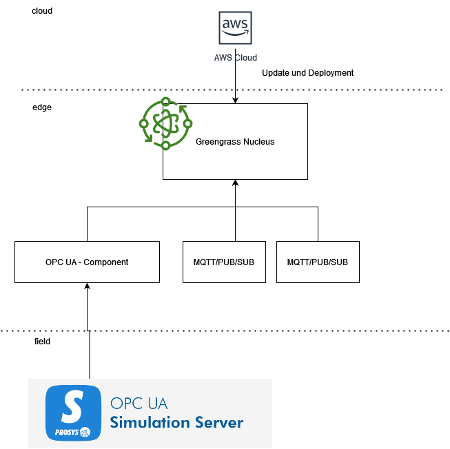

## Custom Components

# Wichtige Punkte

> recipe.yaml  

Konfiguration des Deployments, der Dependencies und wo das publizierte Artefakt heruntergeladen werden muss (i.d.R s3 bucket)

ComponentConfiguration: Parameter die in AWS während des Deployments configuriert werden können
Manifest: Setup der Abhängigkeiten, builds und startup prozesse
AccessControl: Hier können AWS Abhängigkeiten definiert werden (MQTT Zugriff in IoT Core)

> gdk-config.json  

Konfiguration des Greengrass deployments.
Wird benötigt, sobal das Packet publiziert werden soll

# Häufige Probleme

Guide: https://docs.aws.amazon.com/greengrass/v2/developerguide/develop-greengrass-components.html

Greengrass rolle hat keine Berechtigung für Push in S3
